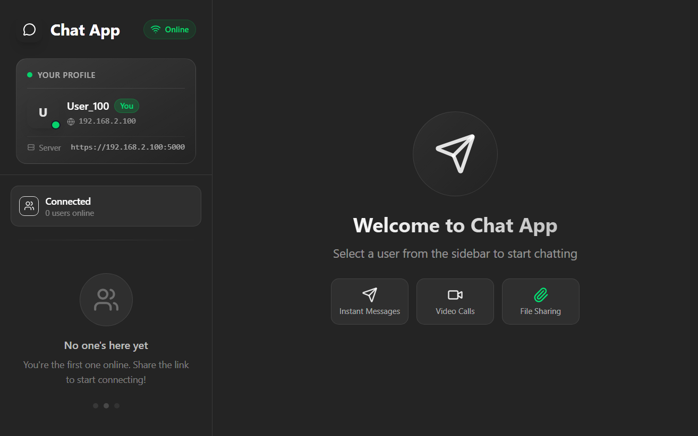
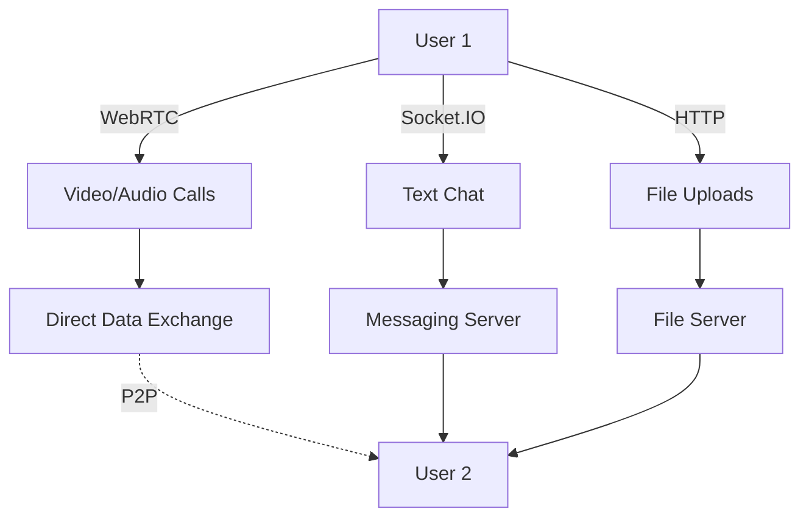
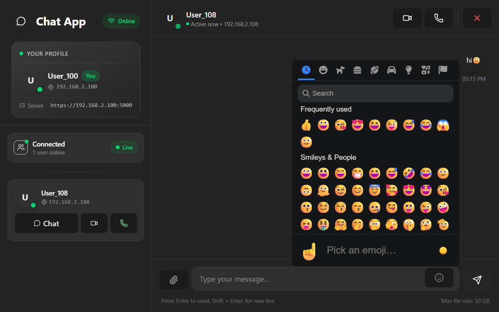
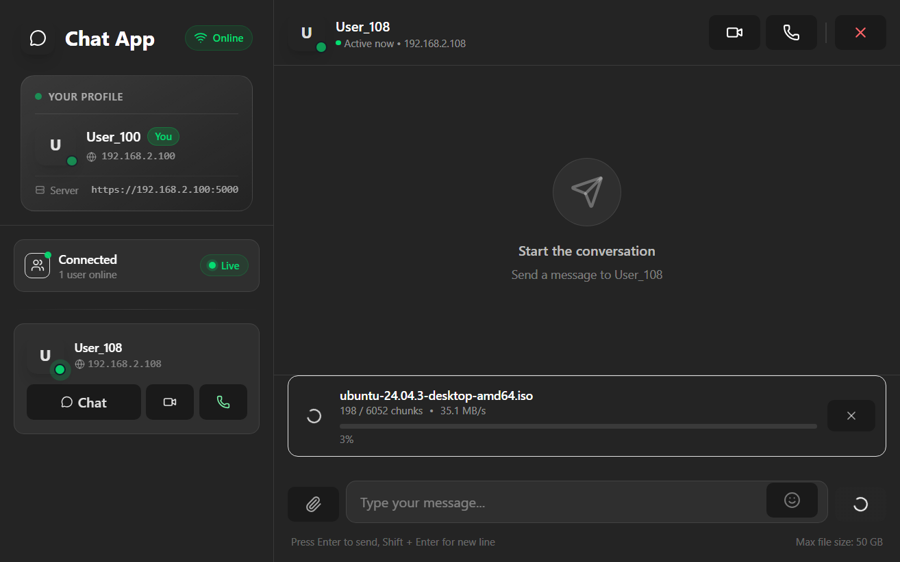
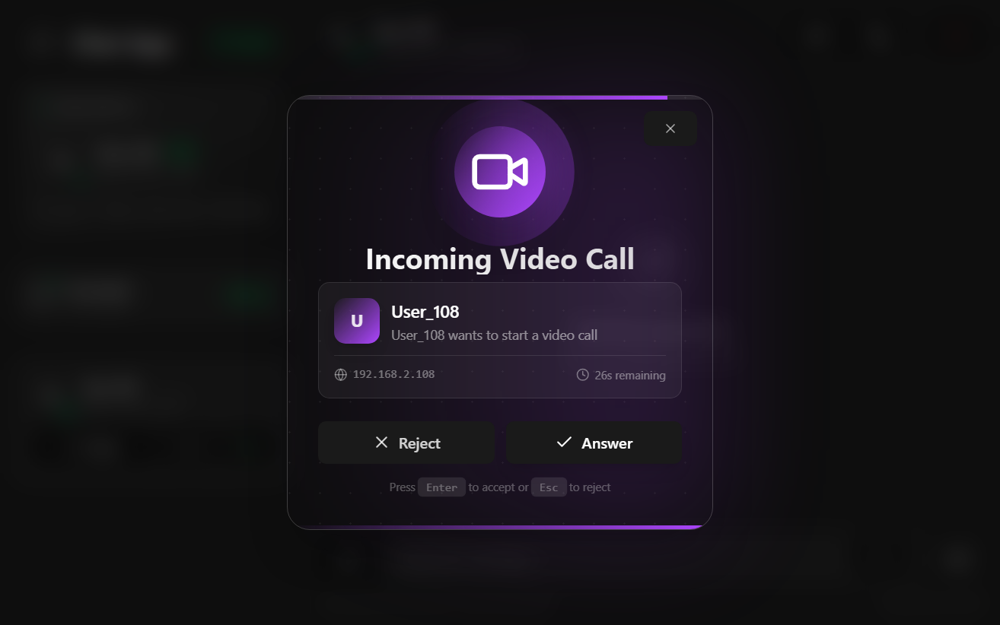
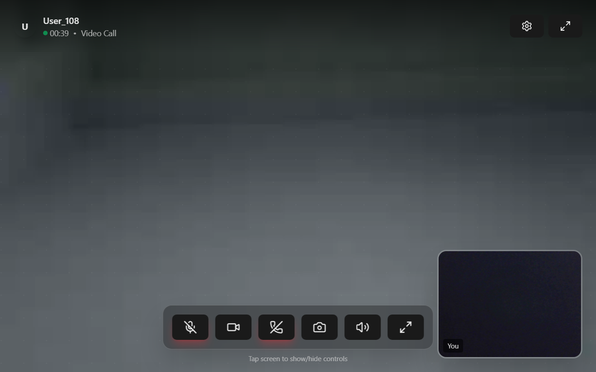

# 🚀 Local Network Chat Application

A comprehensive real-time chat application with video/audio call capabilities, file sharing, emoji support, and offline functionality - all working on your local network.



## ✨ Key Features

### 💬 Instant Communication

- **Real-time text chat** - Send and receive messages instantly
- **Emoji support** - Full emoji integration in conversations
- **Notification system** - Sound alerts for calls and new messages

### 📞 Advanced Calling

- **High-quality video calls** - Using WebRTC technology
- **Clear audio calls** - No lag or distortion
- **Camera switching** - Support for multiple cameras during calls
- **Noise cancellation** - Automatic audio quality enhancement

### 📁 File Sharing

- **Send any file type** - Images, videos, documents, and more
- **Chunked upload** - Support for files up to 10GB
- **Upload progress** - Real-time progress tracking

### 🌐 Offline Operation

- **Complete autonomy** - Works without internet connection
- **Local network only** - Secure and fast
- **Auto-discovery** - Automatically detects users on same network

## 🏗️ Technical Architecture

### Backend

```
Python (Flask) + Socket.IO + WebRTC
```

### Frontend

```
React + TypeScript + Tialwind CSS
```

## 📊 System Architecture Diagram



## 🚀 Installation & Setup

### Prerequisites

- Python 3.8 or higher
- Node.js 16 or higher
- Modern browser (Chrome, Firefox, Edge)

### Installation Steps

#### 1. Download the Project

```bash
git clone https://github.com/3bd0sy/local-chat-app.git
cd local-chat-app
```

#### 2. Backend Setup

```bash
# Create virtual environment
python -m venv venv

# Activate environment
# Windows:
venv\Scripts\activate
# Mac/Linux:
source venv/bin/activate

# Install required libraries
pip install -r requirements.txt
```

#### 3. Frontend Setup

```bash
cd frontend
npm install
npm run build
```

#### 4. Run the Application

```bash
##Start server
cd Server
python app.py

##Start frontend
cd Client
npm start
```

#### 5. Access the Application

```
https://[your-ip-address]:5000
```

## 🎮 How to Use

### 1. **Start the Application**

- Open the app in your browser
- Enter your username
- Click "Connect"

### 2. **Discover Users**

- See all users connected to the same network
- View their status (online, busy, in call)

### 3. **Start a Chat**

1. Click on a user from the list
2. Choose "Start Chat"
3. Wait for request acceptance
4. Start chatting!

### 4. **Make a Call**

1. From chat screen
2. Click 📞 for audio calls
3. Or click 📹 for video calls
4. Adjust settings (camera, microphone)

### 5. **Send Files**

1. Click on file icon
2. Select desired file
3. Watch progress bar
4. File automatically delivers to recipient

## 📱 User Interface

### 🔹 Main Screen


### 🔹 Chat Interface



### 🔹 File Sharing



### 🔹 Video Request



### 🔹 Video Call



## 🔒 Security & Privacy

### ✅ Security Features

- **Direct user-to-user connection** - No data passing through external servers
- **Data encryption** - All communications are encrypted
- **No chat logging** - Complete privacy
- **Full permission control** - Camera, microphone, files

## 🌟 Share Your Feedback

We welcome your feedback and suggestions!

[Email](mailto:ax.abdo.syrain@gmail.com)
[linked in](https://www.linkedin.com/in/abdulbasit-abdulgani)
